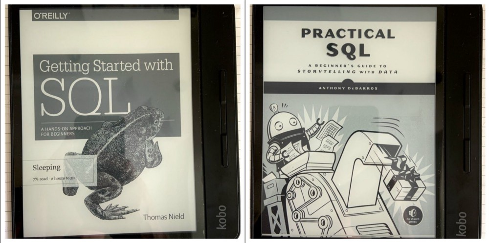

> Track how I refresh my database knowledge

It’s been over two years, but I still recall clearly how I couldn’t explain clearly to the interviews the benefits of using [views](https://en.wikipedia.org/wiki/View_(SQL)) over tables in database design. This is one of the reasons why I’m re-picking up this field again, the other reason being that I’m learning machine learning and data science now.

After a few Google search, I settled on quickly reading through these two books first. _**Getting Started with SQL**_ by Thomas Nield and _**Practical SQL**_ by _Anthony DeBarros_.

I borrowed these two books from OverDrive using my library account, and loaded them into my Kobo Forma ebook reader. Here we go.

## Getting Started with SQL
- [x] Why Learn SQL
- [x] Databases
- [x] SQLite
- [x] SELECT
- [x] WHERE 🚩[Completed on Sep 30, 2020]
- [x] GROUP BY and ORDER BY 🚩[Completed on Oct 2, 2020]
- [x] CASE Statements
- [x] JOIN 🚩[Completed on Oct 3, 2020]
- [ ] Database Design
- [ ] Managing Data

From the contents of the book, it should be easy to read through. Let’s see what I’ll think of after finish it.