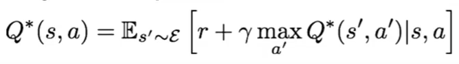

> notes of Stanford CS231n Deep Learning for Computer Vision 2017 edition [Lecture 14 | Deep Reinforcement Learning](https://www.youtube.com/watch?v=lvoHnicueoE&list=PLC1qU-LWwrF64f4QKQT-Vg5Wr4qEE1Zxk&index=15&ab_channel=StanfordUniversitySchoolofEngineering)

## What is reinforcement learning?

### Examples of reinforcement learning: the states, actions and rewards

#### Cart-Pole problem

- Objective: balance a pole on top of a movable cart
- State: angle, angular speed, position, horizontal velocity
- Action: horizontal force applied on the cart
- Reward: 1 at each stept if the pole is uprigght

#### Robot locomotion

- Objective: make the robot move forward
- State: Angle and position of the joints
- Action: Torques applied on joints
- Reward: 1 at each time step uprigght + forward movement

#### Atari Games

- Objective: complete the game with the highest score
- State: Raw pixel inpupts of the game state
- Action: Game controls e.g., left, right, up, down
- Reward: Score increase / decrease at each time step

#### Weiqi

- Objective: win the game
- State: Position of all pieces
- Action: Where to put the next piece down
- Reward: 1 if win at the end of the game, 0 otherwise

## Markov Decision Process

- Mathematically formulation of the RL problem
- **Markov property**: Current state completely characterises the state of the world.

Define by : `(S, A, R, P, λ)`
- S: set of possible states
- A: set of possible actions
- R: distribution of reward given (state, action) pair
- P: transition probability i.e. distribution over next state given (state, action) pair
- λ: discount factor

### Optimal policy pi*

### Value function and Q-value function

#### Value function
- How good is a state
- the expected cumulative reward from following the policy from state s

#### Q-value function
- How good is a state-action pair
- the expected cumulative reward from taking action a in state s and then following the policy

### Bellman equation

The optimal Q-value function Q* is the maximum expected cumulative reward achievable from a given (state, action) pair.

Q* satisfies the following **Bellman equation**:

> Intuition: if the optimal state-action values for the next time-step Q*(s', a') are known, then the optimal strategy is to take the action that maximizes the expected value of 
>
> The optimal policy pi* corresponds to taking the best action in any state as specified by Q*.

### Q-learning

Q-learning: use a function approximator to estimate the action-value function
`Q(s, a; theta) <- Q*(s, a)`

If the function approximator is a deep neural network => **deep q-learning**.

#### Q-network architecture of Atari game

